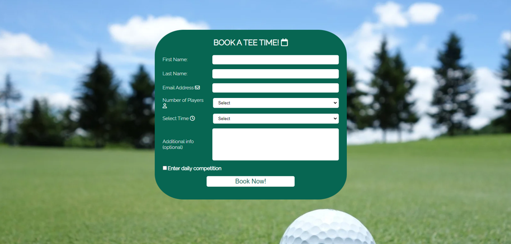

# Clare Golf Club

Welcome to Clare Golf Club, a premier golfing destination located in county Clare in the west of Ireland. Surrounded by natural beauty, our club offers an exceptional 18-hole course that combines the best of tree-lined and links-style holes. Whether you're a seasoned golfer or a newcomer to the sport, Clare Golf Club promises a memorable golfing experience for players of all levels.

The purpose of this website is to allow anyone to get a preview of the course and book a round for upto 4 players. The main goal for a website like this would be to entice a new customer or a one time customer like a tourist to come play our course. There is an abundance of golf courses in the west of Ireland a website like this would help Clare Golf Club stand out from the crowd.

View the deployed website [here.](https://jkirkby95.github.io/Portfolio-1/)

## Table of Contents

## User Experience

### Project Goals

- Firstly, it should be obvious that this is a golf club when you click onto the site.

- Use plenty of images to show off our course and to entice new players to play here.

- It should be easy to book a tee time so I placed multiple links to do so on the home page.

- Provide contact information and other useful tools to answer any questions the customer would have e.g the weather on a certain day.

- Provide a brief description of featured holes to give the player an idea of how the course plays.

### User Stories

- As a customer, I want to be able to navigate the website easily.

- As a customer, I want to be able to learn about the course before I book a time.

- As a customer, I want to be able to book a tee time directly from the site.

- As a customer, I want to be able to find contact information for the business.

- As a customer, I want to find social media links to the business.

- As a customer, I want to easily find the business' location.

### Color Scheme

The colors used in this website are mainly a darker shade of green (#076652) and white. I also used some gold (#FFD700) to highlight the headings on a darker background in the gallery section. A shade of beige was used on the call to action section to make it stand out but i didn't want it to be distracting. I took inspiration from the masters green jacket for my color scheme.

### Typography

The main font used on my site is Raleway, with Sans Serif as the fallback font in case Raleway is not being imported correctly. For my logo I used the Dancing Script font to add some style to it. I used Google fonts to import these styles.

### Wireframes

For my wireframes I used [Balsamiq](https://balsamiq.com/), my wireframes didn't end up exactly like the final project but it gave me a great idea of how it would look.

Page | Wireframe
--- | --- 
Index | 
Book Now | 
Gallery | 

## Features

### General

- Responsive design accross all device sizes.

- Used similar colors and design accross all pages to keep everything clean and to present information clearly.

**Header**

- The header is made up of the club logo (which also can be used to navigate to the home screen) and a full responsive navigation bar.

- The header is identical in all pages of the website for consistency.

- The navigation bar has links to the 3 main pages of the site.

- It also shows enlarged and underlined text on the page you are currently on.

- The links in the nav bar also have a hover effect for a better user experience.

**Footer**

- The footer is also identical accross all pages of the website.

- It contains social media links for the club, which have a hover effect with a color to match each platform.

- The footer also contains a contact us section, with an address for the club, phone number and E-mail information that contain links to use them.

- The footer also contains a quick links section that contains helpful information you may need when coming to the course.

- Finally the footer contains opening times for the course and the pro shop.

**Landing Page**

- Hero Image

The hero image is probably the first thing a customer would notice when visiting our site, so I wanted to use a great shot of the course and include a call to action. As the main purpose of the page is to attract players.

- Welcome section

- The welcome section seemed to be a big part of a lot of golf club sites i saw while doing my research.

- Similar to mine they mostly contain a few photos of the course and a call to action.

- The welcome section that I took the most inspiration from was the [Trump international at Doonbeg website](https://www.trumpgolfireland.com/)

### Book Now page

**Form to book a tee time**

- Form contains 5 mandatory fields first name , last name , e-mail , time and number of players.

- It also contains 2 optional fields to leave a message or to enter the daily competition.

**Map on Book now page**

- This section displays a Google map of the courses geographical location. This allows the players to easily find the location from their devices.

### Booking succesful page

- This page is only accessed when a user completes a booking and it will direct you back to the home page.

