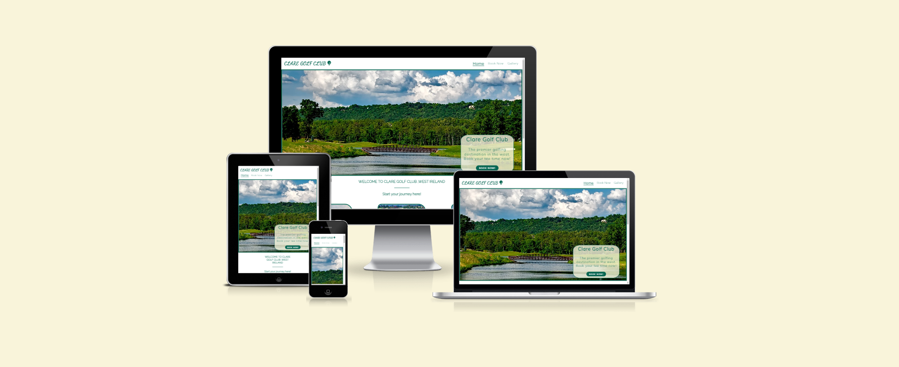

# Clare Golf Club

Welcome to Clare Golf Club, a premier golfing destination located in county Clare in the west of Ireland. Surrounded by natural beauty, our club offers an exceptional 18-hole course that combines the best of tree-lined and links-style holes. Whether you're a seasoned golfer or a newcomer to the sport, Clare Golf Club promises a memorable golfing experience for players of all levels.

The purpose of this website is to allow anyone to get a preview of the course and book a round for upto 4 players. The main goal for a website like this would be to entice a new customer or a one time customer like a tourist to come play our course. There is an abundance of golf courses in the west of Ireland a website like this would help Clare Golf Club stand out from the crowd.

View the deployed website [here.](https://jkirkby95.github.io/Portfolio-1/)

## User Experience

### The purpose of this website

- Firstly, it should be obvious that this is a golf club when you click onto the site.

- Use plenty of images to show off our course and to entice new players to play here.

- It should be easy to book a tee time so I placed multiple links to do so on the home page.

- Provide contact information and other useful tools to answer any questions the customer would have e.g the weather on a certain day.

- Provide a brief description of featured holes to give the player an idea of how the course plays.

### Color Scheme

