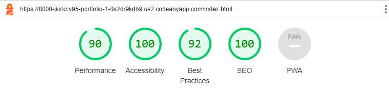

# Clare Golf Club

Welcome to Clare Golf Club, a premier golfing destination located in county Clare in the west of Ireland. Surrounded by natural beauty, our club offers an exceptional 18-hole course that combines the best of tree-lined and links-style holes. Whether you're a seasoned golfer or a newcomer to the sport, Clare Golf Club promises a memorable golfing experience for players of all levels.

The purpose of this website is to allow anyone to get a preview of the course and book a round for upto 4 players. The main goal for a website like this would be to entice a new customer or a one time customer like a tourist to come play our course. There is an abundance of golf courses in the west of Ireland a website like this would help Clare Golf Club stand out from the crowd.

View the deployed website [here.](https://jkirkby95.github.io/Portfolio-1/)

## Table of Contents

## User Experience

### Project Goals

- Firstly, it should be obvious that this is a golf club when you click onto the site.

- Use plenty of images to show off our course and to entice new players to play here.

- It should be easy to book a tee time so I placed multiple links to do so on the home page.

- Provide contact information and other useful tools to answer any questions the customer would have e.g the weather on a certain day.

- Provide a brief description of featured holes to give the player an idea of how the course plays.

### User Stories

- As a customer, I want to be able to navigate the website easily.

- As a customer, I want to be able to learn about the course before I book a time.

- As a customer, I want to be able to book a tee time directly from the site.

- As a customer, I want to be able to find contact information for the business.

- As a customer, I want to find social media links to the business.

- As a customer, I want to easily find the business' location.

### Color Scheme

The colors used in this website are mainly a darker shade of green (#076652) and white. I also used some gold (#FFD700) to highlight the headings on a darker background in the gallery section. A shade of beige was used on the call to action section to make it stand out but i didn't want it to be distracting. I took inspiration from the masters green jacket for my color scheme.

### Typography

The main font used on my site is Raleway, with Sans Serif as the fallback font in case Raleway is not being imported correctly. For my logo I used the Dancing Script font to add some style to it. I used Google fonts to import these styles.

### Wireframes

For my wireframes I used [Balsamiq](https://balsamiq.com/), my wireframes didn't end up exactly like the final project but it gave me a great idea of how it would look.

Page | Wireframe
--- | --- 
Index | 
Book Now | 
Gallery | 

[Back to top ⇧](#Clare-Golf-Club)

## Features

### General

- Responsive design accross all device sizes.

- Used similar colors and design accross all pages to keep everything clean and to present information clearly.

**Header**

- The header is made up of the club logo (which also can be used to navigate to the home screen) and a full responsive navigation bar.

- The header is identical in all pages of the website for consistency.

- The navigation bar has links to the 3 main pages of the site.

- It also shows enlarged and underlined text on the page you are currently on.

- The links in the nav bar also have a hover effect for a better user experience.

**Footer**

- The footer is also identical accross all pages of the website.

- It contains social media links for the club, which have a hover effect with a color to match each platform.

- The footer also contains a contact us section, with an address for the club, phone number and E-mail information that contain links to use them.

- The footer also contains a quick links section that contains helpful information you may need when coming to the course.

- Finally the footer contains opening times for the course and the pro shop.

**Home Page**

- Hero Image

The hero image is probably the first thing a customer would notice when visiting our site, so I wanted to use a great shot of the course and include a call to action. As the main purpose of the page is to attract players.

- Welcome section

- The welcome section seemed to be a big part of a lot of golf club sites i saw while doing my research.

- Similar to mine they mostly contain a few photos of the course and a call to action.

- The welcome section that I took the most inspiration from was the [Trump international at Doonbeg website](https://www.trumpgolfireland.com/)

### Book Now page

**Form to book a tee time**

- Form contains 5 mandatory fields first name , last name , e-mail , time and number of players.

- It also contains 2 optional fields to leave a message or to enter the daily competition.

**Map on Book now page**

- This section displays a Google map of the courses geographical location. This allows the players to easily find the location from their devices.

### Booking succesful page

- This page is only accessed when a user completes a booking and it will direct you back to the home page.

### Gallery Page

- The gallery page is designed to show off some of our best holes, to give players an idea of how the course plays.

- The gallery page features holes 1, 3, 5, 7, 10, 11, 12, and 17.

- Also each image has a hover effect to tell you which hole the photo is of, and to tell you a bit about each hole. (as seen below)

[Back to top ⇧](#Clare-Golf-Club)

## Technologies Used

### Languages used

- [HTML5](https://en.wikipedia.org/wiki/HTML5)

- [CSS3](https://en.wikipedia.org/wiki/CSS)

### Frameworks, Libraries and Programs used

- [Google fonts](https://fonts.google.com/)

Google fonts was used to import the Raleway , Mulish and Dancing Script fonts.

- [Font Awesome](https://fontawesome.com/)

Font Awesome was used to import useful icons for my page for a better visual experience.

- [Pixelied](https://pixelied.com/)

Used to change images from jpg to webp. To reduce the file size.

- [Codeanywhere](https://app.codeanywhere.com/)

Codeanywhere was used for writing code, committing and pushing to Github.

- [Github](https://github.com/)

Github was used to store the project after pushing.

- [Balsamiq](https://balsamiq.com/)

Balsamiq was used to make the wireframes for this project.

- [Am I Responsive](https://ui.dev/amiresponsive)

Am I responsive was used to make a mockup image for this README file and to check how responsive my site is.

- [Chrome Dev tools](https:/developer.chrome.com/docs/devtools/)

 Chrome DevTools was used during development process for code review and to test responsiveness.

 - [W3C Markup Validator](https://validator.w3.org/)

 W3C Markup Validator was used to validate the HTML code.

 - [W3C CSS Validator](https://jigsaw.w3.org/css-validator/)

W3C CSS Validator was used to validate the CSS code.

[Back to top ⇧](#Clare-Golf-Club)

## Testing

### Testing User Stories

- As a customer, I want to be able to navigate the website easily.

The nav bar is very simple on this site to help with this it has only 3 options, and enhanced and underlined text to show the user what page they are on currently.

- As a customer, I want to be able to learn about the course before I book a time.

This is done in multiple ways, firstly is through the flyover video on our youtube channel linked on the Home page.

Secondly this is done through the Gallery page where you get details about some of our featured holes.

- As a customer, I want to be able to book a tee time directly from the site.

The main goal of the website is to attract players so making it easy to book a time is essential, we did this by having 3 different links to book now on the Home page alone.

- As a customer, I want to be able to find contact information for the business.

This is done mostly through the footer of the page and we have 1 other link to our email on the Home page.

- As a customer, I want to find social media links to the business.

This is also done through the footer of the website, so it's on every page.

- As a customer, I want to easily find the business' location.

The location can be found in two places, firstly in the footer again so it's on each page.

Secondly it's on the book now page below the form, this time in the form of a Google map.

### Code Validation

- When running my code through the I did find a few errors.

W3C Markup Validator found an error concerning my Iframe I used, it had inline styling included so all I had to do was move the same styling to the css.style sheet.

W3C Markup Validator also found an error where I had misspelled "class" as "classs" in one occasion.

- Thankfully I found no errors in the CSS validator.

### Accessibility

- Used Lighthouse in Chrome DevTools to confirm that the colors and fonts being used in throughout the website are easy to read and accessible.

**Home Page**

**Book Now Page**

**Booking Succeddful Page**

**Gallery Page**

### Tools testing 

- Chrome DevTools was used during the development process to test, explore and modify HTML elements and CSS styles used in the project.

- Chrome DevTools was also used to test responsiveness in different screen sizes during the development process.

### Manual Testing